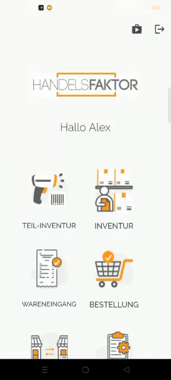
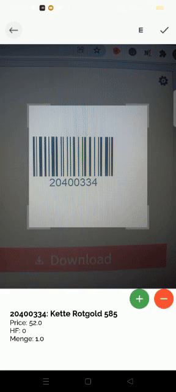
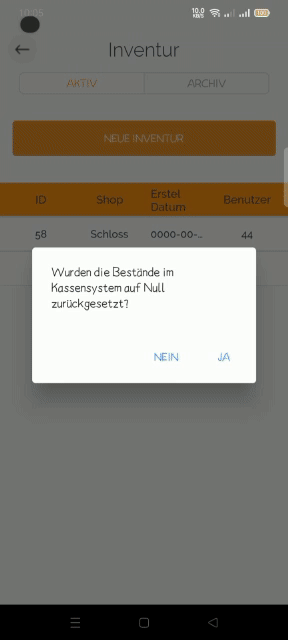

<h1 align="center">
HANDELSFAKTOR Telenorma Mobile App
</h1>

    

# ℹ️ Overview
- An Flutter app developed, to be a great documentation for any beginners
- Flutter
- BloC pattern
- PHP BackEnd

# :iphone: Screens
1-The app can handle any server error:

2- Can add/update/delete/view any destination:

3- Can add/update/delete/view any destination:

